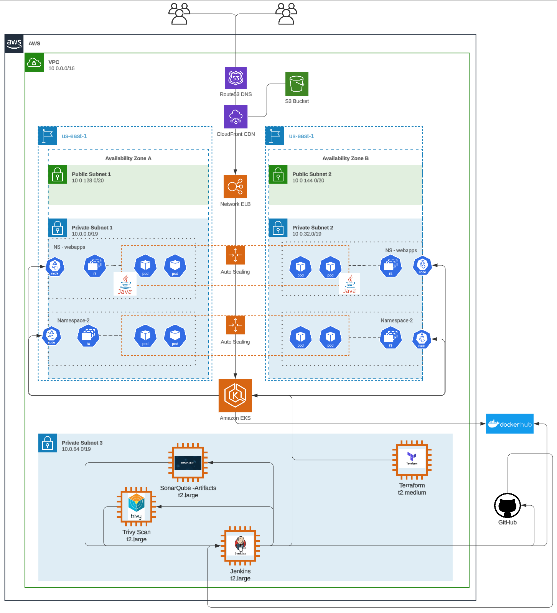
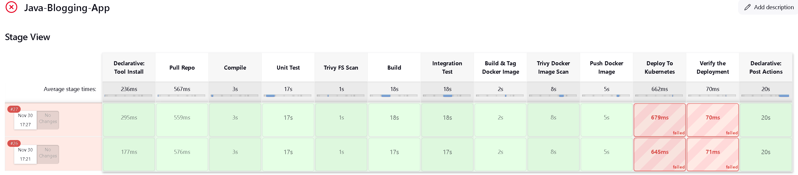
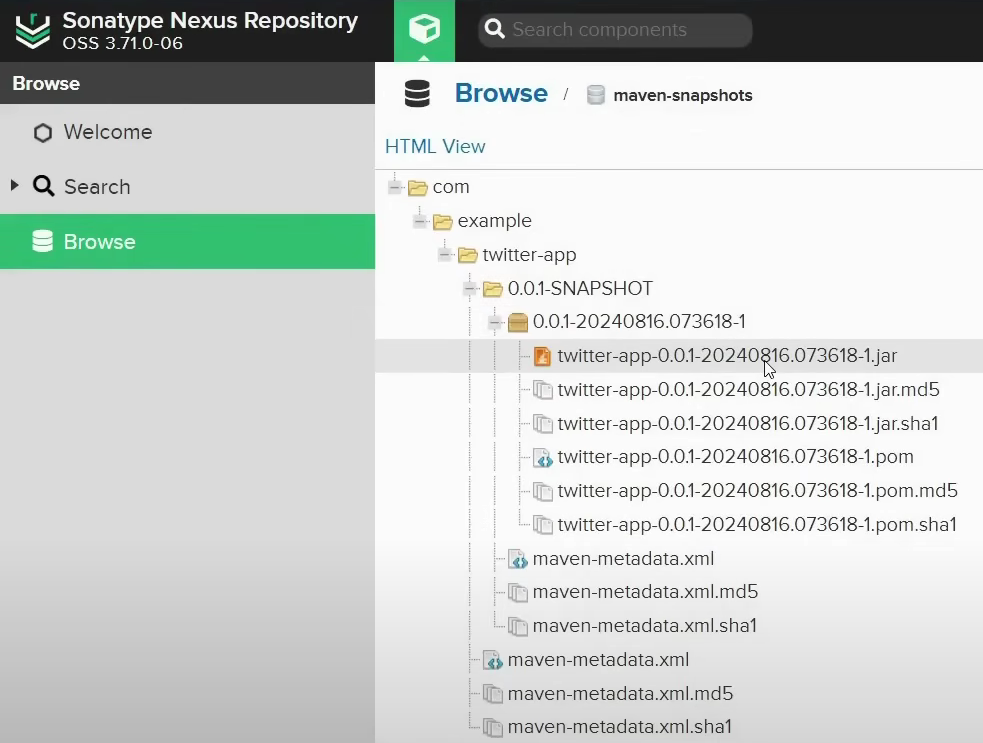
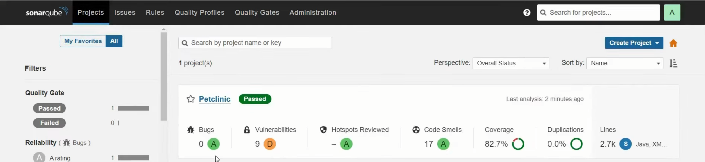
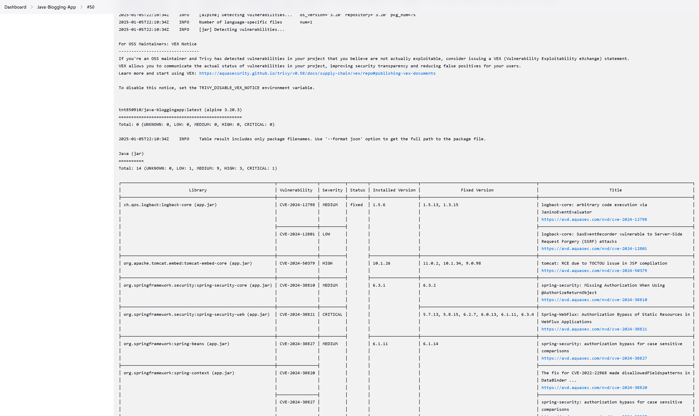
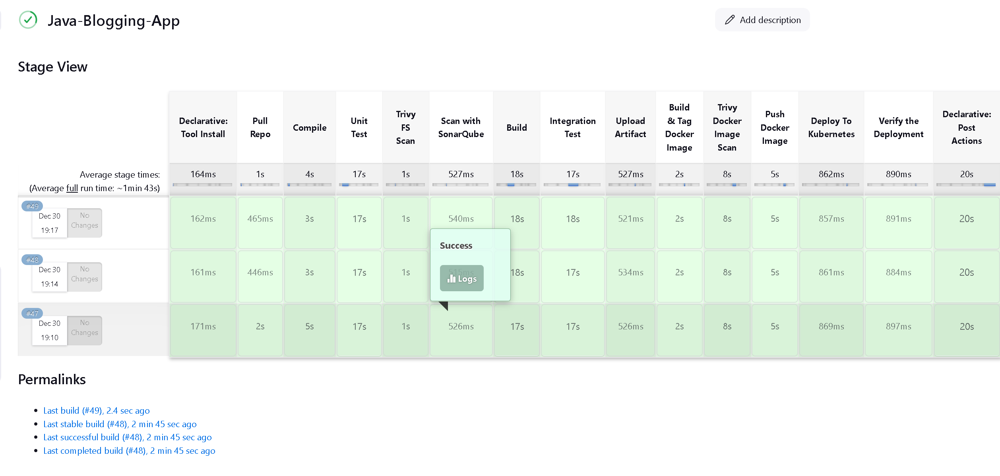
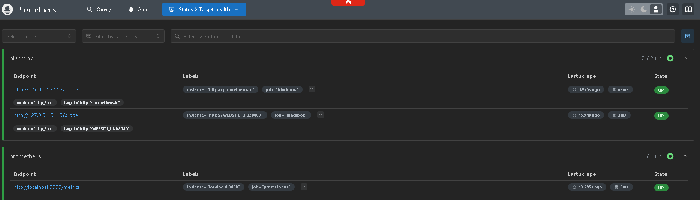
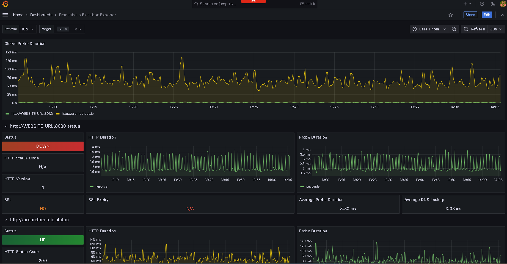

# Jenkins CI/CD Lab for a Java Service

A hands-on Jenkins delivery lab that moves a Maven/Spring Boot service through
build, analysis, artifact storage, container scanning, EKS deployment, and
monitoring.

The Java workload is deliberately small. The focus of the repository is the
delivery path around it:

```text
GitHub
  └──► Jenkins
         ├──► Maven build and tests
         ├──► SonarQube analysis
         ├──► Nexus artifact publication
         ├──► Docker build
         ├──► Trivy source and image scans
         └──► Kubernetes deployment on EKS
                  └──► Prometheus and Grafana
```



## Repository contents

| Path | Purpose |
| --- | --- |
| [`pom.xml`](pom.xml) | Spring Boot 3.3 / Java 17 build and artifact metadata |
| [`Dockerfile`](Dockerfile) | Packages the Maven-built JAR into a Java runtime image |
| [`deployment-service.yml`](deployment-service.yml) | Stable Kubernetes deployment, service, and autoscaler |
| [`deployment-service-canary.yml`](deployment-service-canary.yml) | Canary deployment example |
| [`images/`](images) | Captures from the Jenkins, Nexus, EKS, Terraform, Trivy, SonarQube, Prometheus, and Grafana setup |
| [`.github/workflows/pr_init_checks.yml`](.github/workflows/pr_init_checks.yml) | Pull-request-only Maven validation |

The Terraform configuration used to create the Jenkins and EKS environment is
maintained in
[`devops-install-scripts`](https://github.com/T-Py-T/devops-install-scripts).

## Local validation

Requirements:

- Java 17;
- Maven 3.9+; and
- Docker if you want to build the container image.

Validate the Maven project:

```bash
mvn --batch-mode --no-transfer-progress verify
```

Build the container after a JAR is available under `target/`:

```bash
docker build -t java-delivery-lab:local .
```

Parse the Kubernetes resources before applying them:

```bash
python -m pip install pyyaml
python - <<'PY'
from pathlib import Path
import yaml

for path in (Path("deployment-service.yml"), Path("deployment-service-canary.yml")):
    list(yaml.safe_load_all(path.read_text()))
    print(f"ok: {path}")
PY
```

The Kubernetes manifests reference a private Docker Hub image and a
`regcred` pull secret. Replace the image name and create the registry secret in
your own cluster before deployment.

## Jenkins pipeline setup

The original lab used these integrations:

1. GitHub for source control and webhook events.
2. Maven and Java 17 for compile, test, and package steps.
3. SonarQube for static analysis.
4. Nexus Repository Manager for Maven artifacts.
5. Docker and Trivy for image creation and vulnerability scanning.
6. Terraform for the AWS network and EKS cluster.
7. `kubectl` for deployment and rollout checks.
8. Prometheus and Grafana for cluster and workload monitoring.

Configure Jenkins credentials for GitHub, Nexus, Docker Hub, and AWS through
the Jenkins credential store. Do not put those values in the Jenkinsfile,
Maven settings, or Kubernetes manifests.

The Nexus URLs in [`pom.xml`](pom.xml) describe the original lab environment.
Replace them with your repository manager URL before publishing artifacts.

## Deployment flow

After the Maven and security gates pass:

```bash
docker build -t <registry>/java-bloggingapp:<version> .
docker push <registry>/java-bloggingapp:<version>
```

Update the image in the Kubernetes manifest, then deploy it:

```bash
kubectl apply --dry-run=server -f deployment-service.yml
kubectl apply -f deployment-service.yml
kubectl rollout status deployment/bloggingapp-deployment
kubectl get pods,svc,hpa
```

The stable manifest runs two replicas behind a `LoadBalancer` service and uses
an HPA targeting CPU utilization. The canary file shows a second track with a
separate service so a new image can be exercised independently.

## Screenshots

| Stage | Capture |
| --- | --- |
| Jenkins pipeline |  |
| Nexus artifacts |  |
| SonarQube |  |
| Trivy |  |
| EKS deployment |  |
| Prometheus |  |
| Grafana |  |

Additional infrastructure captures are available in [`images/`](images).

## License

Repository-specific code, manifests, and documentation are available under the
[MIT License](LICENSE). The Maven wrapper retains its Apache License 2.0
headers; see [THIRD_PARTY_NOTICES.md](THIRD_PARTY_NOTICES.md).
