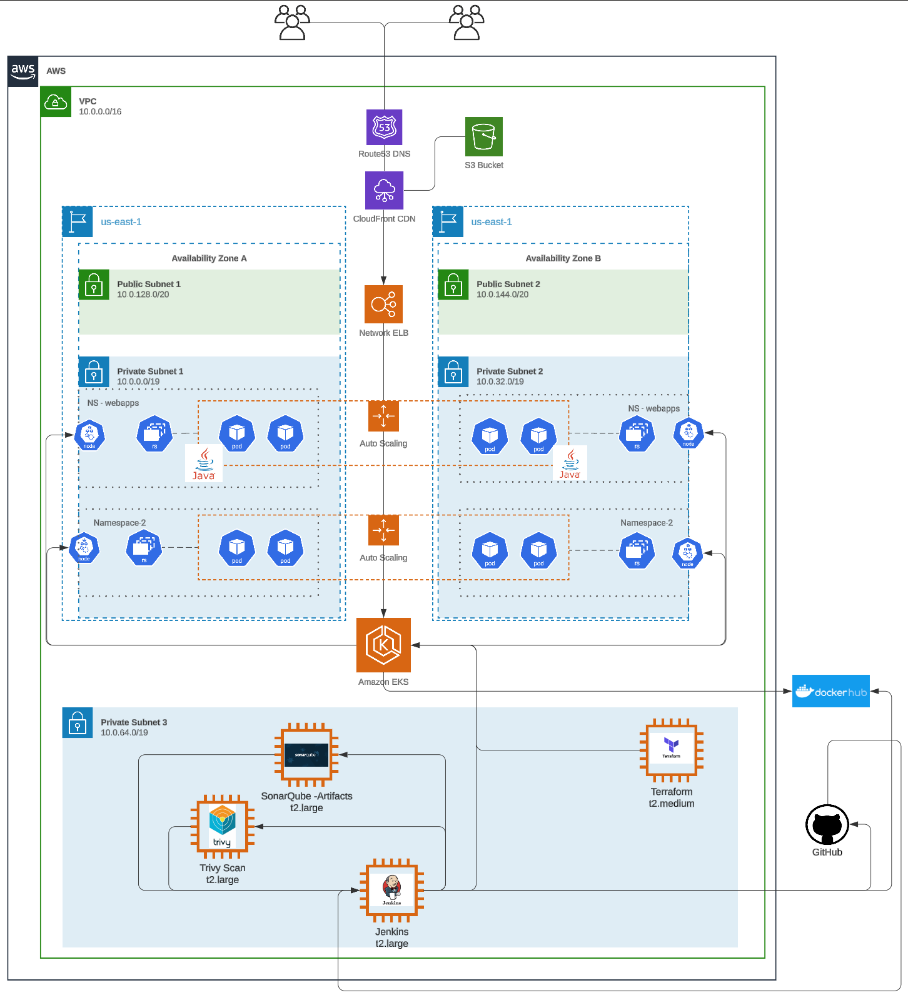
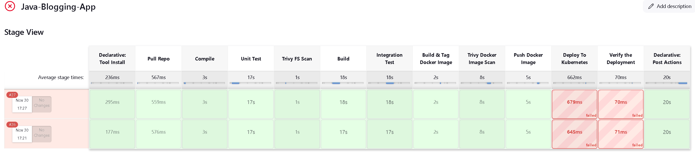
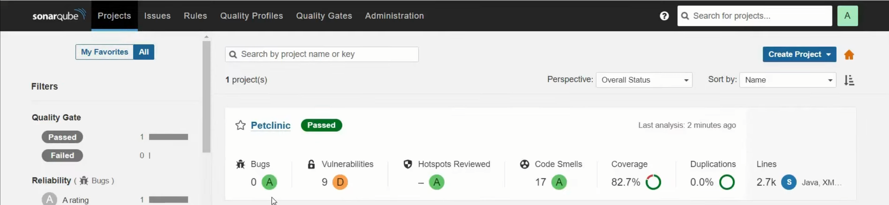
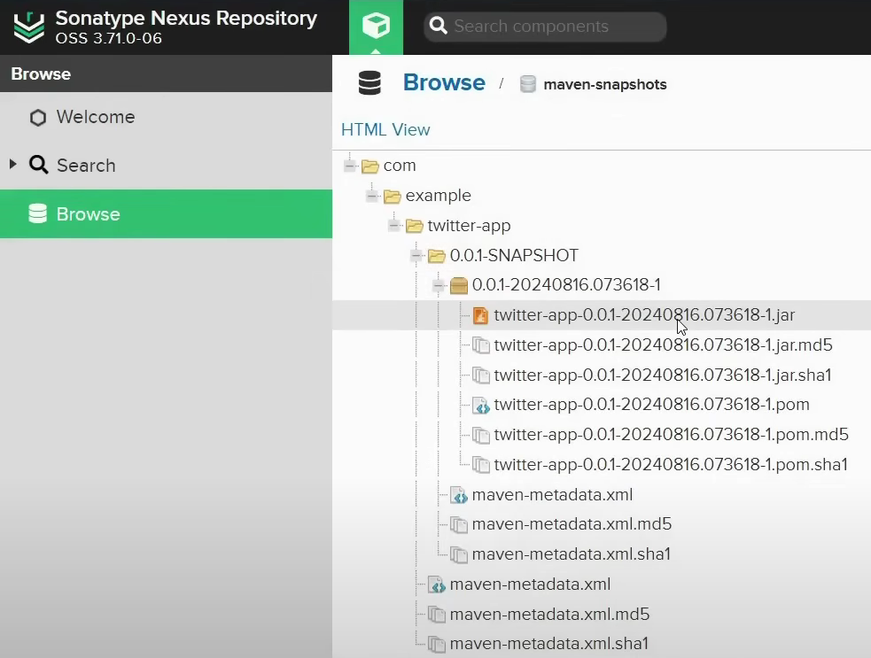
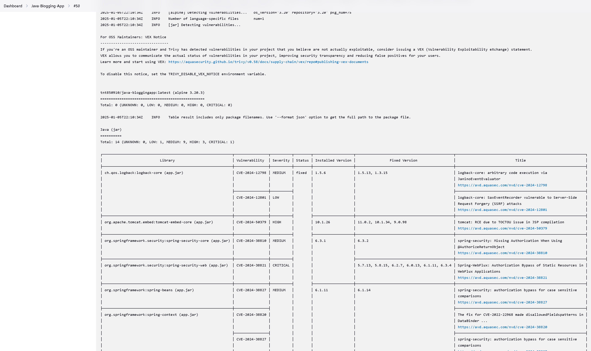
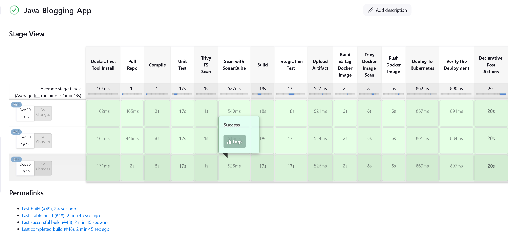
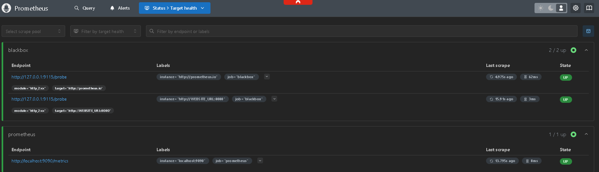
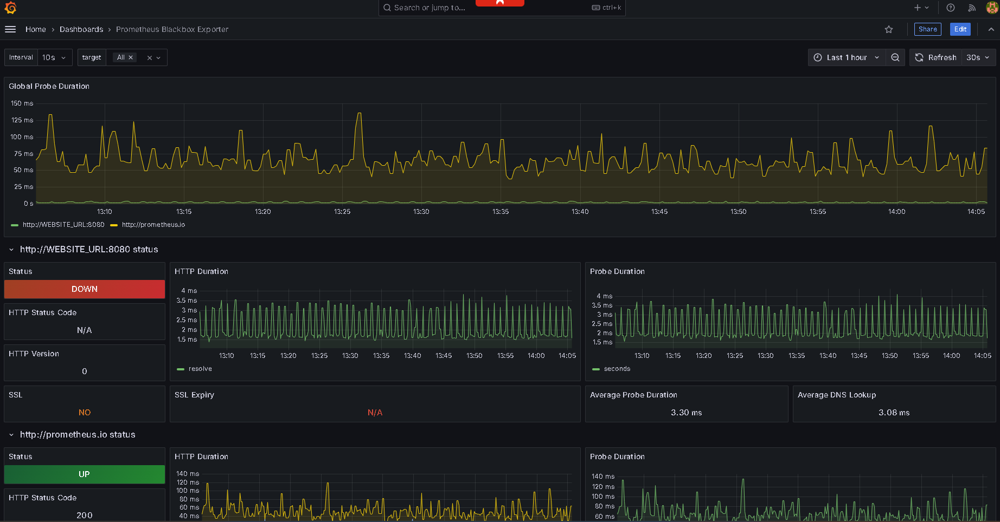

<div align="center">

# Jenkins CI/CD Lab for a Java Web App

**A small Spring Boot app you can run in a minute, and the full Jenkins → SonarQube → Nexus → Trivy → EKS path built around it.**

A hands-on delivery lab. The workload is a tiny posting app (register, sign in,
share a post). The real subject is the pipeline that builds, analyses,
publishes, scans, deploys and monitors it.

[](https://github.com/T-Py-T/Full-Jenkins-CICD-Java-WebApp/actions/workflows/pr_init_checks.yml)

[Getting started](#getting-started) ·
[Demo](#demo-register-sign-in-post) ·
[Delivery path](#the-delivery-path) ·
[Gallery](#gallery) ·
[Contributing](#contributing)



<sub>Lab design diagram. The Jenkins, SonarQube, Nexus and EKS environment shown here is not running from this repository today.</sub>

</div>

## What's inside

- **A Spring Boot web app** (Java 17, Spring Boot 4.1, Spring Security,
  Thymeleaf, H2 in-memory database) with form login and a post feed.
- **A Maven build** with tests and a JaCoCo coverage report, plus Nexus
  publishing coordinates from the original lab.
- **A container image definition**: [`Dockerfile`](Dockerfile) packages the
  built JAR onto a digest-pinned Temurin 17 JRE.
- **Kubernetes manifests**: a stable track with two replicas, a
  `LoadBalancer` service and a CPU autoscaler
  ([`deployment-service.yml`](deployment-service.yml)), plus a canary example
  ([`deployment-service-canary.yml`](deployment-service-canary.yml)).
- **Captures** of the lab's Jenkins, SonarQube, Nexus, Trivy, Terraform, EKS,
  Prometheus and Grafana stages under [`images/`](images).

## Getting started

### Prerequisites

- Java 17 (a JDK)
- Maven 3.9+
- Optional: Docker, to build the image; `kubectl` and a cluster, to deploy

> The checked-in `mvnw` wrapper can't run on its own because
> `.mvn/wrapper/maven-wrapper.properties` is missing. Use an installed
> `mvn`, as CI does.

### Build and test

```bash
git clone https://github.com/T-Py-T/Full-Jenkins-CICD-Java-WebApp.git
cd Full-Jenkins-CICD-Java-WebApp
mvn --batch-mode --no-transfer-progress verify
```

This compiles the app, runs the Spring context test, writes a JaCoCo report
to `target/site/jacoco/`, and produces `target/twitter-app-0.0.3.jar`.

## Demo: register, sign in, post

Start the app:

```bash
java -jar target/twitter-app-0.0.3.jar
```

Open `http://localhost:8080/register`, create an account, sign in at
`/login`, and add a post from `/add`. Data lives in an in-memory H2 database
and disappears when the app stops.

Prefer the terminal? The same flow with `curl`:

```bash
curl -s -o /dev/null -w '%{http_code}\n' -d 'username=demo&password=demo-pass' \
  http://localhost:8080/register                       # 302 → /register?success
curl -s -c jar.txt -b jar.txt -o /dev/null -w '%{http_code}\n' \
  -d 'username=demo&password=demo-pass' http://localhost:8080/login     # 302 → /
curl -s -c jar.txt -b jar.txt -o /dev/null -w '%{http_code}\n' \
  --data-urlencode 'content=Hello from the delivery lab' http://localhost:8080/add
curl -s -b jar.txt http://localhost:8080/ | grep 'Hello from the delivery lab'
```

Before you sign in, everything except a few public paths (`/login`,
`/register`, static images and the H2 console) redirects to `/login`.

## The delivery path

```text
GitHub
  └──► Jenkins
         ├──► Compile and unit tests (Maven)
         ├──► Trivy filesystem scan
         ├──► Build and integration test (Maven)
         ├──► Docker build and tag
         ├──► Trivy image scan
         ├──► Push image
         └──► Deploy to Kubernetes (EKS) and verify
                  └──► Prometheus and Grafana

Side integrations: SonarQube analysis and Nexus artifact storage
```

The stages above follow the lab's Jenkins capture. SonarQube and Nexus
appear in their own captures. The Jenkinsfile itself isn't in this
repository. What is here is the app, its build, the Dockerfile, and the
manifests that pipeline consumed.

The AWS network, EKS cluster and tool hosts were created with Terraform kept
in a separate repository,
[`devops-install-scripts`](https://github.com/T-Py-T/devops-install-scripts).

### Build the image

Not run for this README:

```bash
docker build -t <registry>/java-bloggingapp:<version> .
docker push <registry>/java-bloggingapp:<version>
```

### Check the manifests offline

Both manifest files parse as YAML (3 resources each):

```bash
python -m pip install pyyaml
python - <<'PY'
from pathlib import Path
import yaml

for path in (Path("deployment-service.yml"), Path("deployment-service-canary.yml")):
    list(yaml.safe_load_all(path.read_text()))
    print(f"ok: {path}")
PY
```

For a schema check, `kubeconform -strict` accepts all three resources in
`deployment-service.yml`. The canary file needs work before use (see
[Known rough edges](#known-rough-edges)).

### Deploy to your own cluster

Not run for this README; this needs your own registry, cluster and
credentials. Replace `tnt850910/java-bloggingapp:latest` with your image and
create a `regcred` pull secret first.

```bash
kubectl apply --dry-run=server -f deployment-service.yml
kubectl apply -f deployment-service.yml
kubectl rollout status deployment/bloggingapp-deployment
kubectl get pods,svc,hpa
```

Keep GitHub, Nexus, Docker Hub and AWS credentials in the Jenkins credential
store, never in the Jenkinsfile, Maven settings or manifests. The Nexus URLs
in [`pom.xml`](pom.xml) point at the original lab host; replace them before
publishing.

## Gallery

Historical captures from the original lab run. They show what each stage
looked like then; they are not evidence that anything is running now.

| Stage | Capture |
| --- | --- |
| Jenkins pipeline (both captured runs failed at the deploy and verify stages) |  |
| SonarQube analysis |  |
| Nexus artifacts |  |
| Trivy scan |  |
| Kubernetes deployment |  |
| EKS cluster |  |
| Prometheus |  |
| Grafana |  |

Terraform plan/apply, EC2, EKS networking and Nexus dashboard captures are
also in [`images/`](images).

## Known rough edges

These are known gaps in the current files, not fixed here:

- `deployment-service-canary.yml` reuses the stable Deployment
  (`bloggingapp-deployment`) and HPA (`bloggingapp`) names. Applying both
  files in one namespace would overwrite the stable track.
- The canary file also misspells `livenessProbe` (`livinessProbe`), uses the
  removed `autoscaling/v2beta1` API, and targets port 8081, while the app
  listens on 8080 by default.
- `mvnw` is missing its `.mvn/wrapper` configuration.
- The repository has no Jenkinsfile.

## Contributing

Good first contributions: fix one of the rough edges above, add tests for the
controllers, add a Jenkinsfile that matches the documented path, or improve
the manifests.

1. Fork the repository and branch from `main`.
2. Make a focused change.
3. Run `mvn --batch-mode --no-transfer-progress verify` (CI runs the same
   command in a Maven 3.9 / Temurin 17 container).
4. Never commit credentials, registry passwords or kubeconfigs.
5. Open a pull request against `main`.

Please report vulnerabilities privately as described in
[SECURITY.md](SECURITY.md).

## License

Repository-specific code, manifests and documentation are available under the
[MIT License](LICENSE). The Maven wrapper scripts keep their Apache License
2.0 headers; see [THIRD_PARTY_NOTICES.md](THIRD_PARTY_NOTICES.md).
